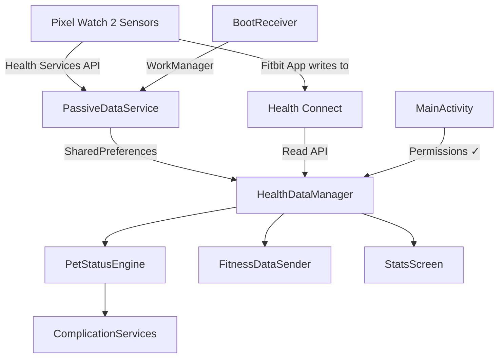

# Standardize Fitbit / Health Services Data for WetPet Watch App

## Problem

All health data (steps, heart rate, calories, etc.) shows as **0** in the WetPet app. After researching the codebase, Fitbit Web API docs, and Wear OS Health Services documentation, I identified **5 root causes**.

## Root Cause Analysis

| # | Issue | Impact |
|---|-------|--------|
| 1 | **No runtime permission requests** | `BODY_SENSORS` and `ACTIVITY_RECOGNITION` are declared in the manifest but never requested at runtime. On Android 10+ (API 29), these are dangerous permissions that **must** be prompted. Health Services silently returns nothing. |
| 2 | **No capability check** | The app registers for `STEPS_DAILY`, `CALORIES_DAILY`, `FLOORS_DAILY`, `DISTANCE_DAILY` without checking if the device supports them. If unsupported, registration silently fails. |
| 3 | **Fields declared but never populated** | `heartRateVariability`, `skinTemperature`, `spo2` exist as fields but are never read from any data source. HRV is not available via PassiveMonitoring on most Wear OS devices; SpO2 and skin temp are Fitbit-proprietary. |
| 4 | **Callback-only listener** | Using `setPassiveListenerCallback()` only delivers data while the app is in the foreground with an active callback. When the screen turns off, data stops flowing. A `PassiveListenerService` is needed for background delivery. |
| 5 | **No boot re-registration** | Passive listener registrations don't survive reboots. After a watch restart, no data flows until the user manually opens the app. |

## Proposed Changes

### 1. Runtime Permission Flow

#### [MODIFY] [MainActivity.kt](file:///home/braindead/github/watch-app/wetpet-watch-app/wear/src/main/java/com/tamagotchi/pet/MainActivity.kt)

Add runtime permission request on launch for `BODY_SENSORS` and `ACTIVITY_RECOGNITION`. Only start `HealthDataManager` after permissions are granted.

```diff
+import android.Manifest
+import android.content.pm.PackageManager
+import androidx.activity.result.contract.ActivityResultContracts
+import androidx.core.content.ContextCompat

 class MainActivity : ComponentActivity() {
   private lateinit var healthDataManager: HealthDataManager
+  
+  private val REQUIRED_PERMISSIONS = arrayOf(
+    Manifest.permission.BODY_SENSORS,
+    Manifest.permission.ACTIVITY_RECOGNITION
+  )

   override fun onCreate(savedInstanceState: Bundle?) {
     super.onCreate(savedInstanceState)
     healthDataManager = HealthDataManager(this)
-    healthDataManager.start()
+    requestPermissionsAndStart()
     setContent { WetPetWearApp(healthDataManager) }
   }
+
+  private fun requestPermissionsAndStart() {
+    val needed = REQUIRED_PERMISSIONS.filter {
+      ContextCompat.checkSelfPermission(this, it) != PackageManager.PERMISSION_GRANTED
+    }
+    if (needed.isEmpty()) {
+      healthDataManager.start()
+    } else {
+      permissionLauncher.launch(needed.toTypedArray())
+    }
+  }
+
+  private val permissionLauncher = registerForActivityResult(
+    ActivityResultContracts.RequestMultiplePermissions()
+  ) { grants ->
+    if (grants.values.all { it }) healthDataManager.start()
+  }
```

---

### 2. Capability Check + PassiveListenerService

#### [MODIFY] [HealthDataManager.kt](file:///home/braindead/github/watch-app/wetpet-watch-app/wear/src/main/java/com/tamagotchi/pet/HealthDataManager.kt)

- Add `checkCapabilities()` before registering
- Switch from callback to `PassiveListenerService` for background delivery
- Remove fields that can never be populated via Health Services (HRV, SpO2, skinTemp) and document them as requires Health Connect
- Add health data logging for debugging

#### [NEW] [PassiveDataService.kt](file:///home/braindead/github/watch-app/wetpet-watch-app/wear/src/main/java/com/tamagotchi/pet/PassiveDataService.kt)

New background service that receives passive health data even when the app isn't in the foreground. Writes batched data to `SharedPreferences` so `HealthDataManager` and complications can read it.

---

### 3. Boot Re-Registration

#### [NEW] [BootReceiver.kt](file:///home/braindead/github/watch-app/wetpet-watch-app/wear/src/main/java/com/tamagotchi/pet/BootReceiver.kt)

`BroadcastReceiver` that triggers passive listener re-registration via `WorkManager` after device reboot.

#### [MODIFY] [AndroidManifest.xml](file:///home/braindead/github/watch-app/wetpet-watch-app/wear/src/main/AndroidManifest.xml)

- Add `RECEIVE_BOOT_COMPLETED` permission
- Register `BootReceiver`
- Register `PassiveDataService` with Health Services binding permission

---

### 4. Health Connect Fallback for Fitbit-Exclusive Metrics

#### [MODIFY] [HealthDataManager.kt](file:///home/braindead/github/watch-app/wetpet-watch-app/wear/src/main/java/com/tamagotchi/pet/HealthDataManager.kt)

Add optional Health Connect read for SpO2, HRV, and skin temperature. These are written by the Fitbit app to Health Connect but not available through the passive Health Services API.

#### [MODIFY] [build.gradle.kts](file:///home/braindead/github/watch-app/wetpet-watch-app/wear/build.gradle.kts)

Add `androidx.health.connect:connect-client` dependency.

#### [MODIFY] [AndroidManifest.xml](file:///home/braindead/github/watch-app/wetpet-watch-app/wear/src/main/AndroidManifest.xml)

Add Health Connect permissions for reading SpO2, HRV, and skin temperature records.

---

### 5. Debug Logging Panel

#### [MODIFY] [StatsScreen.kt](file:///home/braindead/github/watch-app/wetpet-watch-app/wear/src/main/java/com/tamagotchi/pet/StatsScreen.kt)

Add a collapsible debug card showing:
- Permission status (granted / denied)
- Supported data types on this device
- Last data update timestamp
- Raw sensor values

---

### 6. Dependencies

#### [MODIFY] [build.gradle.kts](file:///home/braindead/github/watch-app/wetpet-watch-app/wear/build.gradle.kts)

```diff
+    // Health Connect (for Fitbit-exclusive metrics)
+    implementation("androidx.health.connect:connect-client:1.1.0-alpha10")
+
+    // WorkManager (for boot re-registration)
+    implementation("androidx.work:work-runtime-ktx:2.9.0")
```

## Architecture Summary



> [!IMPORTANT]
> **Fitbit-exclusive metrics** (SpO2, HRV, skin temperature) are NOT available through the Wear OS Health Services passive monitoring API. The Fitbit app writes these to **Health Connect**, so we read them from there as a fallback. This is documented behavior — Google explicitly states some Fitbit metrics are not shared through Health Services.

> [!WARNING]
> **Health Connect on Wear OS** — the `connect-client` library works on Wear OS 4+ (Pixel Watch 2 runs Wear OS 4). On older Wear OS devices, these fields will remain at their defaults. The app will gracefully degrade.

## Verification Plan

### Device Testing (Manual — requires Pixel Watch 2)

1. **Install the updated APK** on the watch via `adb install -r`
2. **Permission prompt** should appear on first launch asking for Body Sensors and Activity Recognition
3. **After granting**, open StatsScreen — values should start populating within 30-60 seconds (Health Services batches data)
4. **Reboot the watch** — after restart, open StatsScreen again within 2 minutes. Data should resume without re-opening the app
5. **Check logcat** with `adb logcat -s HealthDataMgr PassiveDataSvc BootReceiver` for data flow

### ADB Debugging Commands

```bash
# Check granted permissions
adb shell dumpsys package com.wetpet.watch | grep permission

# Check Health Services registration
adb shell dumpsys activity service com.google.android.wearable.healthservices | grep wetpet

# Watch logcat for health data flow
adb logcat -s HealthDataMgr:D PassiveDataSvc:D BootReceiver:D
```

> [!NOTE]
> Since we are running in WSL2, adb may need the watch connected via WiFi debugging (`adb connect <watch-ip>:5555`). USB passthrough from WSL2 to a connected watch works with `usbipd-win` but WiFi ADB is more reliable.
